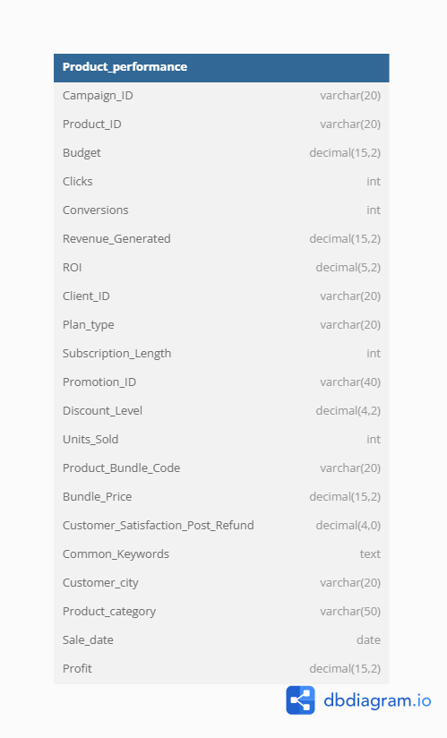

# 🛒 Zudio Product Performance Dashboard

## 📌 Project Overview
A data-driven analysis of **Zudio's** marketing and product performance using real-world techniques in SQL and Power BI. This project showcases how raw marketing and sales data can be transformed into actionable business insights for stakeholders and decision-makers.

## 🧰 Tools & Technologies Used
- **MySQL**: For data querying, transformation, and calculated metrics (e.g., Profit, Category Mapping).
- **Power BI**: For dashboard creation, KPI visualization, and storytelling using DAX.
- **Excel**: For minor data formatting and structure validation.
- **CSV**: Source data imported and queried through MySQL.

## 📁 Project Files

| File Name                               | Description                                                               |
|-----------------------------------------|--------------------------------------------------------------------       |
| `marketing_and_product_performance.csv` | Original dataset pulled through SQL after structure and logic mapping     |
| `Zudio_SQL_Analysis.sql`                | All SQL queries used for cleaning, transformation, and insight extraction |
| `Product_performance.pbix`              | Power BI dashboard file showcasing data visuals and KPIs                  |
| `PP Dashboard.PNG`                      | Static image of the final dashboard                                       |
| `Dashboard_performance.webm`            | Demo video showing dashboard interactivity and navigation                 |

## 🧠 Key Insights Visualized
- 📈 **Top 5 Profitable Products** by Campaign and ROI  
- 🧍 **Customer Segmentation** based on subscription tier and city  
- 💰 **Revenue & Budget Analysis** per marketing effort  
- 🎯 **Conversion Rates & Click-through Metrics**  

## 🔗 Use Cases
- Business stakeholders can monitor performance KPIs in real-time.
- Marketing teams can evaluate campaign efficiency and ROI.
- Product teams gain clarity on high-performing categories and bundles.

## 🚀 Skills Demonstrated
- Data cleaning and transformation using **SQL**  
- Data modeling and relationship mapping for **Power BI**  
- Writing **DAX** expressions to create custom KPIs  
- Interactive visual storytelling through dashboards

## 📽️ Preview

▶️ **[Watch Dashboard Performance](Dashboard_performance.webm)**
🔗 **[Explore SQL Queries used](Zudio_SQL_Analysis.sql)**

---
